# 🌊 Fırat-GNC  
### Otonom Sualtı Sürü Sistemi

**Fırat Üniversitesi – Otonom Sistemler & Yapay Zeka Laboratuvarı** bünyesinde geliştirilmiştir.

Fırat-GNC, çoklu **Sualtı Otonom Araçları (ROV/AUV)** ve **Su Üstü Araçları (ASV)** için tasarlanmış,  
**Yapay Zeka Destekli (GAT)**, **Fizik Tabanlı** ve **İletişim Kısıtlı** bir sürü simülasyon ortamıdır.

---

## ✨ Özellikler

### 🤖 Dağıtık Yapay Zeka (GAT)
- Her ROV, **Graph Attention Networks (GAT)** kullanarak komşularından gelen bilgileri işler.
- Engel, çarpışma ve kopma gibi kritik durumları **yerel karar alma** ile tespit eder.

### 📡 Gerçekçi Akustik İletişim
- Sualtı modem simülasyonu
- **Gecikme (Delay)**, **Paket Kaybı (Packet Loss)** ve **Gürültü (Noise)** modelleri

### ⚓ Fizik Motoru
- **Ursina Engine** tabanlı 3D simülasyon
- Sürtünme, kaldırma kuvveti (buoyancy) ve motor itki dinamikleri

### 🎮 Canlı Konsol (Human-in-the-Loop)
- Simülasyon çalışırken **terminal üzerinden anlık Python komutları**
- Görev atama, parametre değiştirme ve manuel müdahale

### 🧠 Otonom Navigasyon (GNC)
- Engel kaçınma
- Hedef takibi
- Sürü formasyonu koruma

---

## 📸 Ekran Görüntüleri

Sistemin farklı özelliklerini ve kullanım senaryolarını gösteren ekran görüntüleri:

### 🚀 İlk Kurulum ve Genel Bakış

**Şekil 1: Sistem Başlangıç Arayüzü**

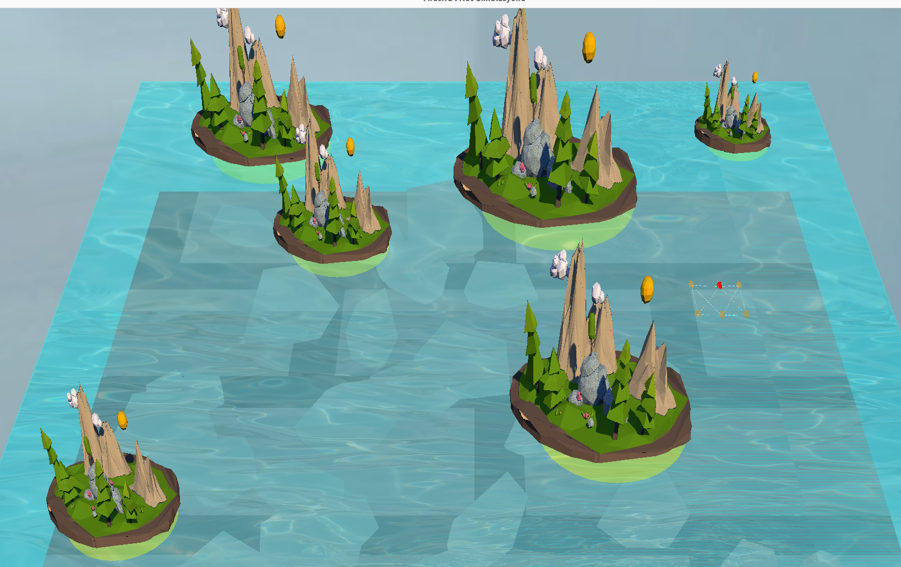

Şekil 1'de sistemin ilk başlatılması sırasında görülen temel arayüz görüntülenmektedir. Ekranda simülasyon ortamının başlangıç durumu, ROV'ların (Sualtı Otonom Araçları) başlangıç konumları ve temel kontrol paneli görülebilir. Şekil 1, kullanıcıya sistemin başarıyla yüklendiğini ve simülasyonun başlamaya hazır olduğunu gösterir. Arayüzde yer alan şekiller ve göstergeler, sistemin farklı bileşenlerinin durumunu ve simülasyon ortamının temel parametrelerini yansıtmaktadır.

**Şekil 2: Convex Hull ile Güvenlik Çevresi Oluşturma**

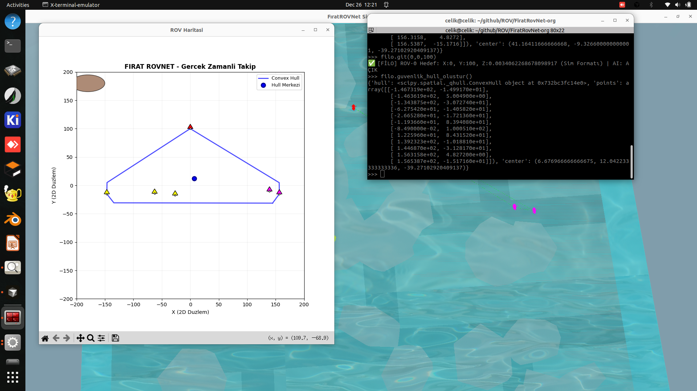

Şekil 2'de ROV sürüsünün convex hull algoritması kullanarak güvenlik çevresi oluşturması görülmektedir. Sistem, ROV'ların konumlarını tespit ederek otomatik olarak bir convex hull (dışbükey örtü) hesaplar ve bu hull'un etrafında yaklaşık 40 metre offset ile bir güvenlik çevresi oluşturur. Şekil 2'de görünen çokgen şekil, ROV sürüsünün kapladığı alanı gösterirken, bu çokgenin etrafındaki güvenlik bandı, engeller olmadığında sürünün güvenli hareket alanını tanımlar. Bu yaklaşım sayesinde ROV'lar, birbirlerine ve çevreye belirli bir güvenlik mesafesi koruyarak hareket eder. Şekil 2, sistemin otomatik güvenlik çevresi oluşturma yeteneğini ve convex hull tabanlı formasyon yönetimini gösterir.

**Şekil 3: Simülasyon Ortamı Alternatif Kamera Açısı**

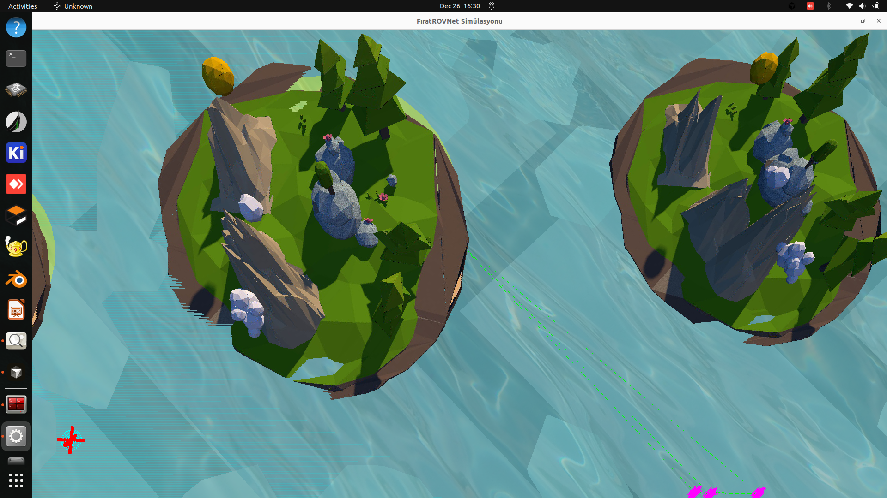

Şekil 3'te simülasyon ortamının farklı bir kamera açısından görünümü sunulmaktadır. Bu açıdan bakıldığında, ROV'ların üç boyutlu konumları, derinlik farklılıkları ve çevresel engeller daha net görülebilir. Şekil 3'te görünen geometrik şekiller (küpler, küreler, düzlemler) sualtı araçlarını, engelleri ve çevresel öğeleri temsil eder. Renk kodlaması sayesinde her ROV'un durumu anlık olarak takip edilebilir. İletişim bağlantıları çizgilerle gösterilmiş, formasyon yapısı ve araçlar arası mesafeler görselleştirilmiştir. Bu şekil, sistemin çoklu araç koordinasyonunu ve 3D fizik simülasyonunun detaylarını gösterir.

### 💻 Konsol Arayüzü

**Şekil 4: Convex Hull Güvenlik Çevresi Görselleştirmesi**

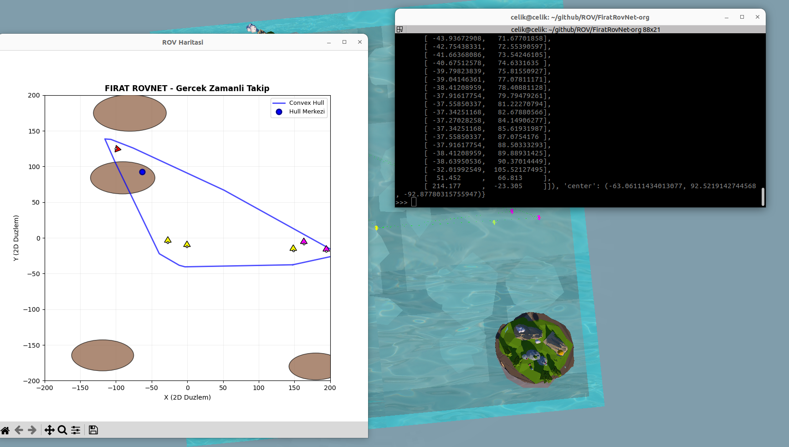

Şekil 4'te convex hull fonksiyonu kullanılarak ROV sürüsü etrafında oluşturulan güvenlik çevresinin görselleştirmesi gösterilmektedir. Sistem, ROV'ların konumlarını tespit edip otomatik olarak bir convex hull hesaplar ve bu hull'un etrafında 40 metre offset ile bir güvenlik bandı oluşturur. Şekil 4'te görünen çokgen yapı, ROV'ların kapladığı alanı gösterirken, bu yapının etrafındaki güvenlik çevresi, sürünün güvenli hareket alanını tanımlar. Bu yaklaşım, ROV'ların birbirlerine ve çevresel engellere belirli bir mesafe koruyarak hareket etmesini sağlar. Şekil 4, sistemin dinamik güvenlik çevresi oluşturma yeteneğini ve convex hull tabanlı koordinasyon mekanizmasını gösterir.

**Şekil 5: Convex Hull ile Dinamik Güvenlik Alanı**

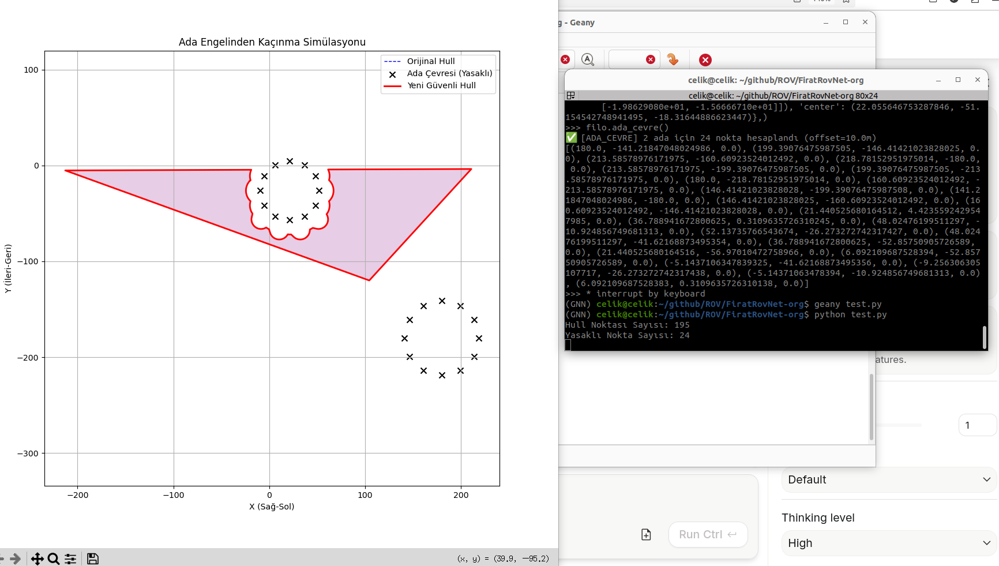

Şekil 5'te convex hull algoritması kullanılarak ROV sürüsü etrafında dinamik olarak oluşturulan güvenlik alanı gösterilmektedir. Sistem, ROV'ların gerçek zamanlı konumlarını analiz ederek sürekli güncellenen bir convex hull hesaplar ve bu hull'un etrafında 40 metre offset ile bir güvenlik çevresi oluşturur. Şekil 5'te görünen çokgen yapı, ROV'ların mevcut formasyonunu ve kapladıkları alanı gösterirken, etrafındaki güvenlik bandı, sürünün güvenli hareket sınırlarını tanımlar. Bu dinamik yaklaşım sayesinde, ROV'lar hareket ettikçe güvenlik çevresi de otomatik olarak güncellenir ve sürü her zaman belirli bir güvenlik mesafesi korur. Şekil 5, sistemin adaptif güvenlik çevresi oluşturma yeteneğini gösterir.

### ⚓ Formasyon Yönetimi

**Şekil 6: Formasyon Bazlı Convex Hull Güvenlik Çevresi**

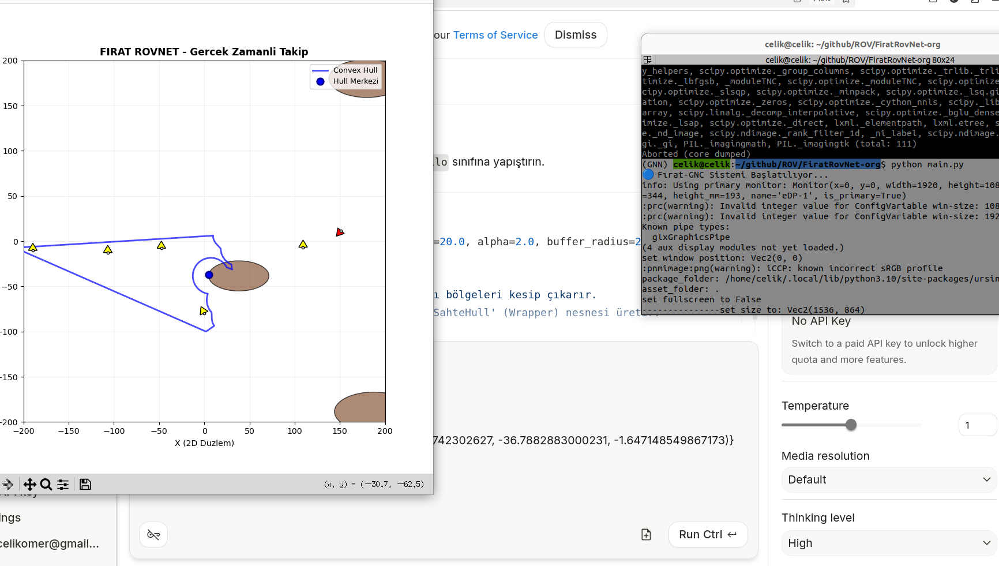

Şekil 6'da ROV sürüsünün formasyon yapısına göre oluşturulan convex hull ve güvenlik çevresi gösterilmektedir. Sistem, ROV'ların formasyon içindeki konumlarını tespit ederek bir convex hull hesaplar ve bu hull'un etrafında 40 metre offset ile bir güvenlik çevresi oluşturur. Şekil 6'da görünen çokgen yapı, ROV'ların formasyon düzenini ve kapladıkları alanı gösterirken, etrafındaki güvenlik bandı, sürünün güvenli hareket alanını tanımlar. Renk kodlaması sayesinde lider araç (kırmızı), normal seyir halindeki araçlar (turuncu) ve diğer durumlar ayırt edilebilir. Şekil 6, sistemin formasyon bazlı güvenlik çevresi oluşturma yeteneğini ve convex hull tabanlı koordinasyon mekanizmasını gösterir. Bu yaklaşım, ROV'ların formasyon içinde güvenli bir şekilde hareket etmesini sağlar.

**Şekil 7: Dinamik Formasyon Geçişi**

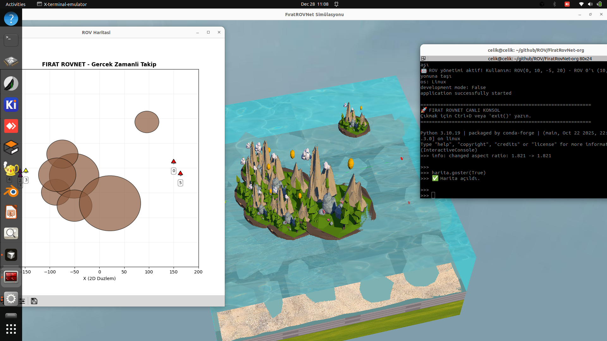

Şekil 7'de ROV sürüsünün farklı bir formasyon yapısını veya dinamik bir durumunu gösterilmektedir. Şekilde görünen şekiller ve bağlantılar, araçların yeni bir formasyon düzenine geçişini veya farklı bir görev senaryosunu yansıtabilir. ROV'ların konumları, renkleri ve birbirlerine olan bağlantıları, sistemin dinamik formasyon yönetimi yeteneğini gösterir. Şekil 7, sistemin farklı formasyon tiplerini desteklediğini ve araçların görev gereksinimlerine göre formasyonlarını değiştirebildiğini gösterir. Formasyon yapısındaki değişiklikler, lider araç veya merkezi koordinasyon noktası etrafında gerçekleşir ve tüm araçlar bu değişikliklere uyum sağlar.

### 🗺️ Harita ve Navigasyon

**Şekil 8: 2D Harita Görünümü**

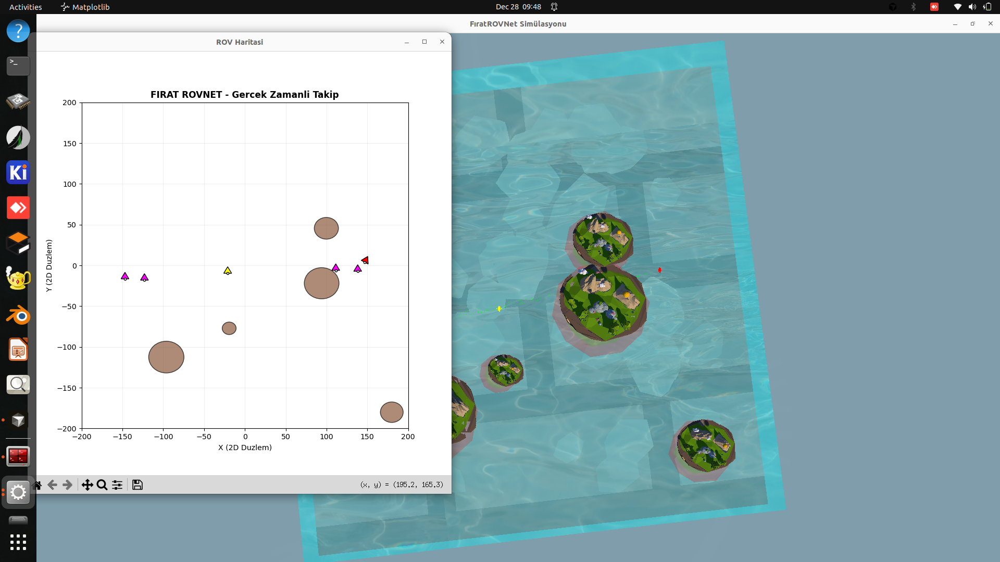

Şekil 8'de simülasyon ortamının 2D harita görünümü gösterilmektedir. Haritada ROV'lar nokta veya küçük şekillerle temsil edilirken, hareket yolları çizgilerle gösterilir. Harita üzerinde engeller (dikdörtgen veya düzensiz şekiller), hedef noktalar ve güvenlik alanları görülebilir. ROV'ların konumları gerçek zamanlı olarak güncellenir ve her araç için geçmiş hareket yolu (trail) görselleştirilebilir. Şekil 8'deki 2D görünüm, kullanıcıya sistemin genel durumunu ve araçların konumlarını üstten bakış açısıyla sunar. Harita görünümü, navigasyon planlaması ve görev yönetimi için kritik bir araçtır.

**Şekil 9: Detaylı Harita Analizi ve Convex Hull**

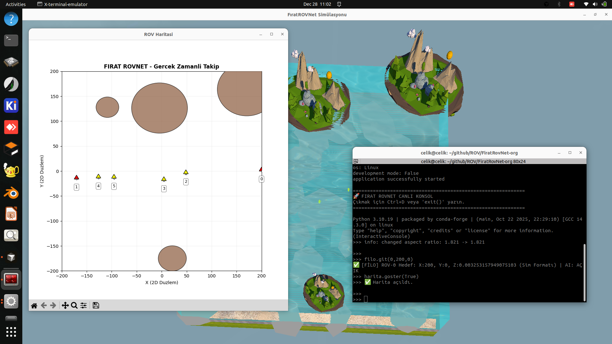

Şekil 9'da harita görünümünün daha detaylı bir versiyonu gösterilmektedir. Haritada görünen çokgen şekiller, ROV sürüsünün convex hull (dışbükey örtü) yapısını temsil eder. Bu geometrik şekil, sürünün kapladığı alanı ve araçların dağılımını gösterir. Şekil 9'da görünen daireler veya çokgenler güvenlik alanlarını, engel bölgelerini veya hedef alanlarını temsil edebilir. ROV'ların konumları, hareket yolları ve formasyon yapısı bu görünümde daha net görülebilir. Convex hull hesaplaması, sürü koordinasyonu ve güvenlik analizi için önemli bir metrik sağlar. Şekil 9, sistemin gelişmiş harita analizi ve görselleştirme yeteneklerini gösterir.

**Şekil 10: A* Algoritması ile Yol Planlama**

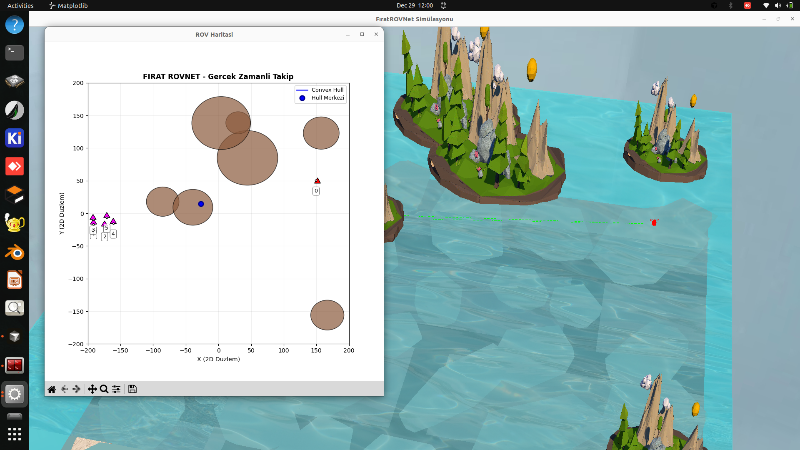

Şekil 10'da sistemin A* (A-star) algoritması kullanarak otomatik yol planlama özelliği gösterilmektedir. Harita üzerinde görünen yeşil veya mavi çizgiler, ROV'un başlangıç noktasından hedef noktaya kadar hesaplanan optimal rotayı temsil eder. Kırmızı veya gri şekiller engelleri gösterirken, grid yapısı veya noktalar arama algoritmasının çalışma alanını gösterir. A* algoritması, her bir grid hücresinin maliyetini hesaplayarak en kısa ve güvenli yolu bulur. Şekil 10, sistemin engel kaçınma yeteneğini ve otomatik navigasyon planlamasını gösterir. ROV'lar, bu algoritma sayesinde karmaşık ortamlarda bile hedeflerine güvenli bir şekilde ulaşabilir.

**Şekil 11: A* Algoritması ile Engelli Ortamda Güvenli Navigasyon**

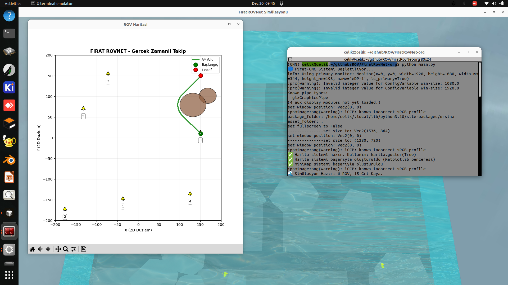

Şekil 11'de sistemin A* algoritması entegrasyonu ile engellerin bulunduğu ortamda güvenli rota planlaması gösterilmektedir. Şekilde görünen çizgiler, ROV'un başlangıç noktasından hedef noktaya kadar A* algoritması tarafından hesaplanan optimal ve güvenli rotayı temsil eder. Sistem, engelleri tespit ederek bu engellerin etrafından geçen güvenli bir yol hesaplar. Şekil 11'de görünen kırmızı veya gri şekiller engelleri gösterirken, yeşil veya mavi çizgi optimal rotayı gösterir. A* algoritması, her bir grid hücresinin maliyetini hesaplayarak hem en kısa hem de en güvenli yolu bulur. Şekil 11, sistemin engel kaçınma yeteneğini ve A* tabanlı güvenli navigasyon planlamasını gösterir. ROV, bu algoritma sayesinde karmaşık ve engelli ortamlarda bile hedeflerine güvenli bir şekilde ulaşabilir.

**Şekil 12: A* ile Çoklu Hedef ve Engelli Ortam Navigasyonu**

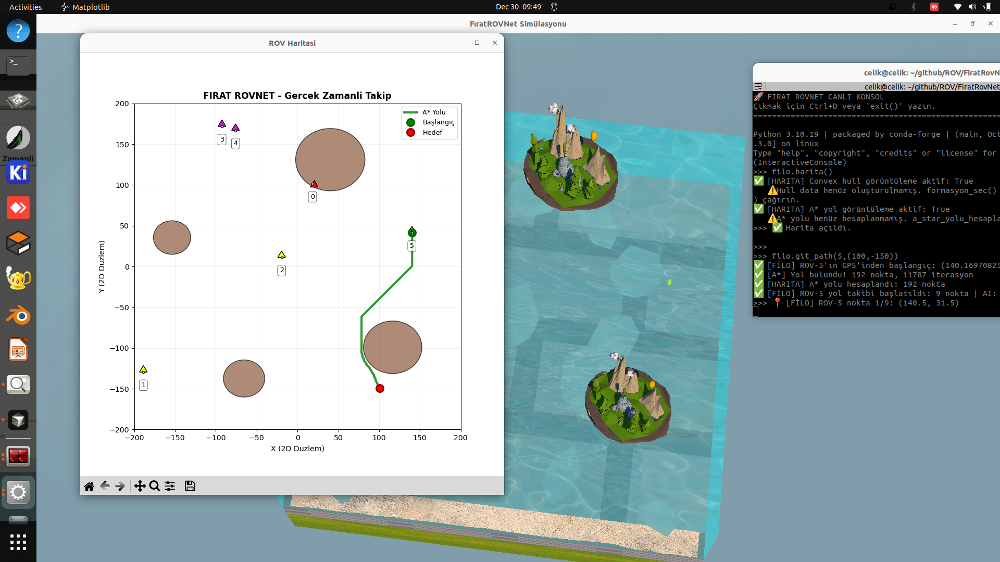

Şekil 12'de sistemin A* algoritması kullanarak çoklu hedef yönetimi ve engelli ortamda güvenli navigasyon özellikleri gösterilmektedir. Şekilde birden fazla hedef noktası görülebilir ve ROV'lar bu hedeflere A* algoritması ile hesaplanan güvenli rotalar üzerinden sırayla veya paralel olarak hareket edebilir. Harita üzerinde görünen farklı renkli şekiller farklı hedefleri, görevleri veya öncelik seviyelerini temsil ederken, engeller kırmızı veya gri renklerle gösterilir. A* algoritması, her hedef için engelleri dikkate alarak optimal ve güvenli rotalar hesaplar. Şekil 12, sistemin karmaşık görev senaryolarını yönetme yeteneğini ve A* tabanlı çoklu hedef optimizasyonunu gösterir. ROV'lar, görev gereksinimlerine göre hedefleri önceliklendirir ve engelli ortamlarda güvenli bir şekilde en uygun sırayla ziyaret eder.

**Şekil 13: A* ile Dinamik Adaptif Rota Planlama**

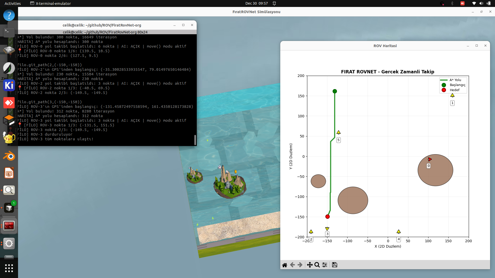

Şekil 13'te sistemin A* algoritması kullanarak dinamik navigasyon senaryosu ve gerçek zamanlı adaptif rota planlama mekanizması gösterilmektedir. Şekilde görünen şekiller ve çizgiler, ROV'un değişen ortam koşullarına göre A* algoritması ile navigasyon planını güncellediğini gösterir. Yeni engellerin ortaya çıkması, hedef konumlarının değişmesi veya formasyon gereksinimlerinin güncellenmesi durumunda sistem otomatik olarak A* algoritmasını yeniden çalıştırarak yeni bir güvenli rota hesaplar. Şekil 13, sistemin adaptif navigasyon yeteneğini ve A* tabanlı gerçek zamanlı karar alma mekanizmasını gösterir. ROV, çevresel değişiklikleri algılayarak navigasyon planını dinamik olarak günceller ve engelli ortamlarda en güvenli rotayı seçer. Bu özellik, sistemin gerçek dünya uygulamalarında güvenilir çalışmasını sağlar.

### 🎮 3D Simülasyon ve Final Görünüm

**Şekil 14: 3D Fizik Motoru Detaylı Görünümü**

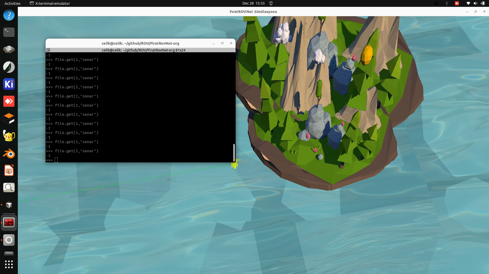

Şekil 14'te Ursina Engine tabanlı 3D simülasyon ortamının detaylı görünümü gösterilmektedir. Şekilde görünen üç boyutlu şekiller (küpler, küreler, düzlemler) ROV'ları, engelleri ve çevresel öğeleri temsil eder. Su yüzeyi, sualtı ortamı ve aydınlatma efektleri fiziksel gerçekçiliği artırır. ROV'ların renkleri durumlarını gösterirken, araçlar arasındaki bağlantı çizgileri iletişim ağını gösterir. Şekil 14, sistemin fizik motorunun (sürtünme, kaldırma kuvveti, motor itki dinamikleri) ve görselleştirme bileşenlerinin entegre çalışmasını gösterir. 3D simülasyon, kullanıcıya sistemin gerçek dünya davranışını anlamak için zengin bir görsel deneyim sunar.

**Şekil 15: A* Entegrasyonu ile Entegre Sistem Final Görünümü**


Şekil 15'te sistemin tüm bileşenlerinin entegre çalıştığı tam özellikli final görünümü gösterilmektedir. Şekilde 3D simülasyon ortamı, harita görünümü, formasyon yapısı, A* algoritması ile hesaplanan navigasyon planları ve konsol çıktıları birlikte görülebilir. ROV'lar farklı renklerle durumlarını gösterirken, iletişim bağlantıları, convex hull yapısı ve A* algoritması ile hesaplanan güvenli hareket yolları görselleştirilmiştir. Şekil 15, sistemin tüm modüllerinin (GAT yapay zeka, GNC navigasyon, A* yol planlama, fizik motoru, iletişim simülatörü) birlikte çalıştığını ve karmaşık görev senaryolarını başarıyla yönetebildiğini gösterir. Sistem, çoklu ROV koordinasyonu, A* tabanlı otonom navigasyon, engel kaçınma ve formasyon yönetimi gibi tüm özelliklerini entegre bir şekilde sunar. Şekil 15, Fırat-GNC sisteminin tam kapasitesini ve gerçek dünya uygulamalarına hazır olduğunu gösterir.

**Şekil 16: Convex Hull ile Güvenlik Çevresi Oluşturma**

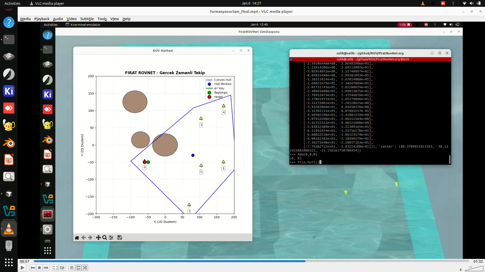

Şekil 16'da ROV sürüsünün convex hull algoritması kullanılarak güvenlik çevresi oluşturması detaylı bir şekilde gösterilmektedir. Sistem, ROV'ların konumlarını tespit ederek otomatik olarak bir convex hull (dışbükey örtü) hesaplar ve bu hull'un etrafında yaklaşık 40 metre offset ile bir güvenlik çevresi oluşturur. Şekil 16'da görünen çokgen yapı, ROV sürüsünün kapladığı alanı gösterirken, bu çokgenin etrafındaki güvenlik bandı, engeller olmadığında sürünün güvenli hareket alanını tanımlar. Bu yaklaşım sayesinde ROV'lar, birbirlerine ve çevreye belirli bir güvenlik mesafesi koruyarak hareket eder. Şekil 16, sistemin otomatik güvenlik çevresi oluşturma fonksiyonunun çalışmasını ve convex hull tabanlı formasyon yönetimini detaylı bir şekilde gösterir.

**Şekil 17: Engeller Tespit Edildiğinde Convex Hull Adaptasyonu**

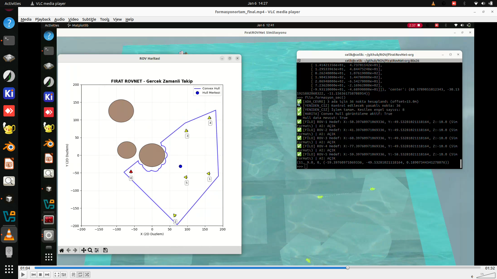

Şekil 17'de sistemin engeller tespit edildiğinde convex hull'un nasıl adapte olduğu ve engelleri dışarda bırakarak büküldüğü gösterilmektedir. Sistem, ROV'ların konumlarını ve çevredeki engelleri tespit ederek convex hull hesaplamasını dinamik olarak günceller. Şekil 17'de görüldüğü gibi, convex hull yapısı engellerin etrafından bükülerek engelleri dışarda bırakır ve sadece ROV'ların bulunduğu güvenli alanları içerir. Bu adaptif yaklaşım sayesinde, güvenlik çevresi engellerin etrafından geçerek ROV'ların güvenli hareket alanını doğru bir şekilde tanımlar. Şekil 17, sistemin engel tespiti sonrası convex hull adaptasyonu yeteneğini ve dinamik güvenlik çevresi oluşturma mekanizmasını gösterir. Bu özellik, sistemin gerçek dünya uygulamalarında engelli ortamlarda güvenilir çalışmasını sağlar.

---

## 📂 Proje Yapısı

```text
StarProjesi/
│
├── main.py                  # Ana çalıştırıcı (Simülasyonu başlatır)
├── rov_modeli_multi.pth     # Eğitilmiş Yapay Zeka Modeli
│
└── FiratROVNet/             # Çekirdek Kütüphane
    ├── __init__.py
    ├── gat.py               # GAT modeli ve eğitim fonksiyonları
    ├── ortam.py             # Veri seti ve senaryo üretimi
    ├── simulasyon.py        # 3D render & fizik motoru
    ├── iletisim.py          # Akustik modem simülatörü
    ├── gnc.py               # Güdüm, Navigasyon ve Kontrol
    └── config.py            # Canlı ayar yönetimi

🛠️ Kurulum

Gerekli Python kütüphanelerini yükleyin:

pip install torch torch_geometric ursina numpy networkx

🧠 Yapay Zeka Eğitimi

İlk çalıştırmadan önce veya modeli güncellemek için eğitim yapılmalıdır.

    Terminali açın ve Python interaktif moda girin

    Aşağıdaki komutları çalıştırın:

from FiratROVNet import gat, ortam

# 1. Eski modeli sıfırla
gat.reset()

# 2. Eğitimi başlat (Dinamik veri ile)
gat.Train(
    veri_kaynagi=lambda: ortam.veri_uret(n_rovs=None),
    epochs=10000
)

    Eğitim tamamlandığında rov_modeli_multi.pth otomatik olarak oluşturulur.

🚀 Çalıştırma
Linux (Grafik Uyumluluk Modu)

LIBGL_ALWAYS_SOFTWARE=1 python main.py

Windows

python main.py

💻 Canlı Konsol Komutları

Simülasyon başladıktan sonra terminal donmaz.
Arka planda çalışan Python kabuğu (>>>) üzerinden sistemi kontrol edebilirsiniz.
1️⃣ Otonom Görev Atama (git)

git(rov_id, x, z, y, ai=True)

Parametre	Açıklama
x, z	Yatay düzlem koordinatları
y	Derinlik (Negatif = su altı)
ai	True: Zeki Mod / False: Kör Mod

Örnekler:

>>> git(1, 50, 50, -5)
>>> git(2, -20, 100, -10, ai=False)

Toplu Formasyon:

>>> for i in range(4):
...     git(i, i*10, 100, -5)

2️⃣ Sistem Ayarları (cfg)

>>> cfg.goster_modem = True
>>> cfg.goster_gnc = True
>>> cfg.ai_aktif = False

3️⃣ Manuel Müdahale (rovs)

>>> rovs[0].move("ileri", 100)
>>> rovs[1].set("engel_mesafesi", 50.0)

>>> from ursina import color
>>> rovs[2].color = color.green

🌈 Renk Kodları ve Durumlar
Renk	Durum	Açıklama
🔴 Kırmızı	Lider / Engel	Lider araç veya engel algılandı
🟠 Turuncu	Güvenli	Normal seyir
⚫ Siyah	Çarpışma	Acil durum
🟡 Sarı	Kopuk	İletişim menzili dışında
🟣 Mor	Uzak	Liderden aşırı uzak
🛑 Çıkış

Simülasyonu güvenli şekilde kapatmak için:

    ESC veya Q tuşuna basın

👨‍💻 Geliştirici

Ömer Faruk Çelik
Mustafa Polat
Gizem Yılmaz
Fırat Üniversitesi
Otonom Sistemler & Yapay Zeka Laboratuvarı
📜 Lisans

MIT License
