# 🌊 Fırat-GNC  
### Otonom Sualtı Sürü Sistemi

**Fırat Üniversitesi – Otonom Sistemler & Yapay Zeka Laboratuvarı** bünyesinde geliştirilmiştir.

Fırat-GNC, çoklu **Sualtı Otonom Araçları (ROV/AUV)** ve **Su Üstü Araçları (ASV)** için tasarlanmış,  
**Yapay Zeka Destekli (GAT)**, **Fizik Tabanlı** ve **İletişim Kısıtlı** bir sürü simülasyon ortamıdır.

<p align="center">
  <a href="./docs/gnc_mimari.md">
    
  </a>
  <a href="./docs/motor_tasarimi.md">
    
  </a>
  <a href="./docs/apf_navigasyon.md">
    
  </a>
  <a href="./docs/BlurROV2Surusu.md">
    
  </a>
</p>

---

## ✨ Özellikler

### 🤖 Dağıtık Yapay Zeka (GAT)
- Her ROV, **Graph Attention Networks (GAT)** kullanarak komşularından gelen bilgileri işler.
- Engel, çarpışma ve kopma gibi kritik durumları **yerel karar alma** ile tespit eder.

### 📡 Gerçekçi Akustik İletişim
- Sualtı modem simülasyonu
- **Gecikme (Delay)**, **Paket Kaybı (Packet Loss)** ve **Gürültü (Noise)** modelleri

### ⚓ Fizik Motoru
- **Ursina Engine** tabanlı 3D simülasyon
- Sürtünme, kaldırma kuvveti (buoyancy) ve motor itki dinamikleri

### 🎮 Canlı Konsol (Human-in-the-Loop)
- Simülasyon çalışırken **terminal üzerinden anlık Python komutları**
- Görev atama, parametre değiştirme ve manuel müdahale

### 🧠 Otonom Navigasyon (GNC)
- Engel kaçınma
- Hedef takibi
- Sürü formasyonu koruma

---

## 📸 Ekran Görüntüleri

Sistemin farklı özelliklerini ve kullanım senaryolarını gösteren ekran görüntüleri:

### 🚀 İlk Kurulum ve Genel Bakış

**Şekil 1: Sistem Başlangıç Arayüzü**

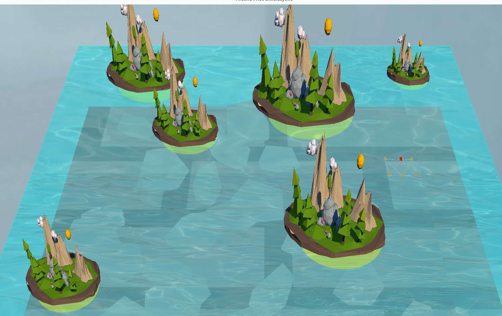

Şekil 1'de sistemin ilk başlatılması sırasında görülen temel arayüz görüntülenmektedir. Ekranda simülasyon ortamının başlangıç durumu, ROV'ların (Sualtı Otonom Araçları) başlangıç konumları ve temel kontrol paneli görülebilir. Şekil 1, kullanıcıya sistemin başarıyla yüklendiğini ve simülasyonun başlamaya hazır olduğunu gösterir. Arayüzde yer alan şekiller ve göstergeler, sistemin farklı bileşenlerinin durumunu ve simülasyon ortamının temel parametrelerini yansıtmaktadır.

**Şekil 2: Convex Hull ile Güvenlik Çevresi Oluşturma**

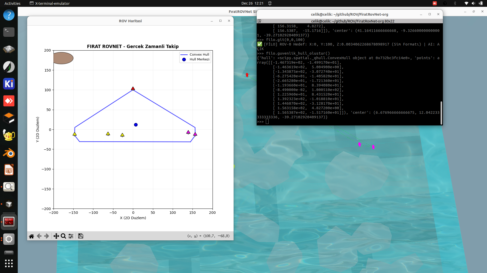

Şekil 2'de ROV sürüsünün convex hull algoritması kullanarak güvenlik çevresi oluşturması görülmektedir. Sistem, ROV'ların konumlarını tespit ederek otomatik olarak bir convex hull (dışbükey örtü) hesaplar ve bu hull'un etrafında yaklaşık 40 metre offset ile bir güvenlik çevresi oluşturur. Şekil 2'de görünen çokgen şekil, ROV sürüsünün kapladığı alanı gösterirken, bu çokgenin etrafındaki güvenlik bandı, engeller olmadığında sürünün güvenli hareket alanını tanımlar. Bu yaklaşım sayesinde ROV'lar, birbirlerine ve çevreye belirli bir güvenlik mesafesi koruyarak hareket eder. Şekil 2, sistemin otomatik güvenlik çevresi oluşturma yeteneğini ve convex hull tabanlı formasyon yönetimini gösterir.

### 💻 Konsol Arayüzü

**Şekil 3: Convex Hull Güvenlik Çevresi Görselleştirmesi**

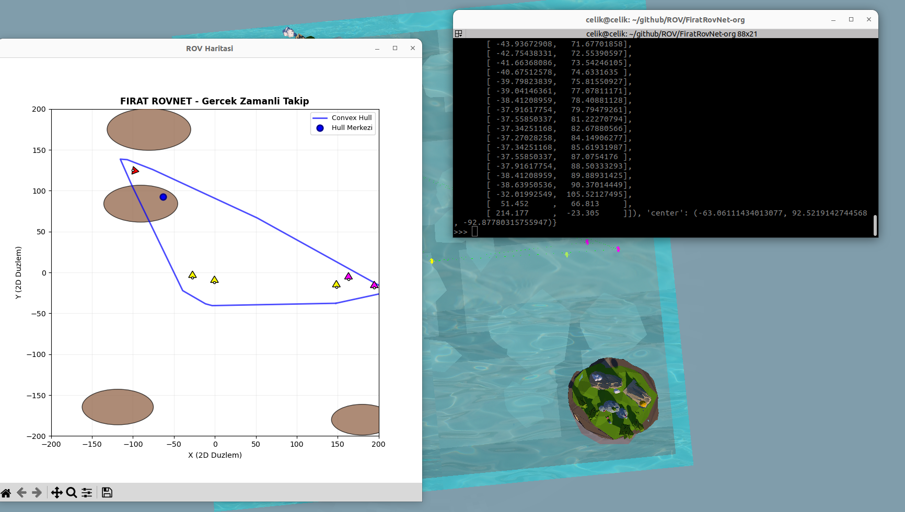

Şekil 3'te convex hull fonksiyonu kullanılarak ROV sürüsü etrafında oluşturulan güvenlik çevresinin görselleştirmesi gösterilmektedir. Sistem, ROV'ların konumlarını tespit edip otomatik olarak bir convex hull hesaplar ve bu hull'un etrafında 40 metre offset ile bir güvenlik bandı oluşturur. Şekil 3'te görünen çokgen yapı, ROV'ların kapladığı alanı gösterirken, bu yapının etrafındaki güvenlik çevresi, sürünün güvenli hareket alanını tanımlar. Bu yaklaşım, ROV'ların birbirlerine ve çevresel engellere belirli bir mesafe koruyarak hareket etmesini sağlar. Şekil 3, sistemin dinamik güvenlik çevresi oluşturma yeteneğini ve convex hull tabanlı koordinasyon mekanizmasını gösterir.

**Şekil 4: Convex Hull ile Dinamik Güvenlik Alanı**

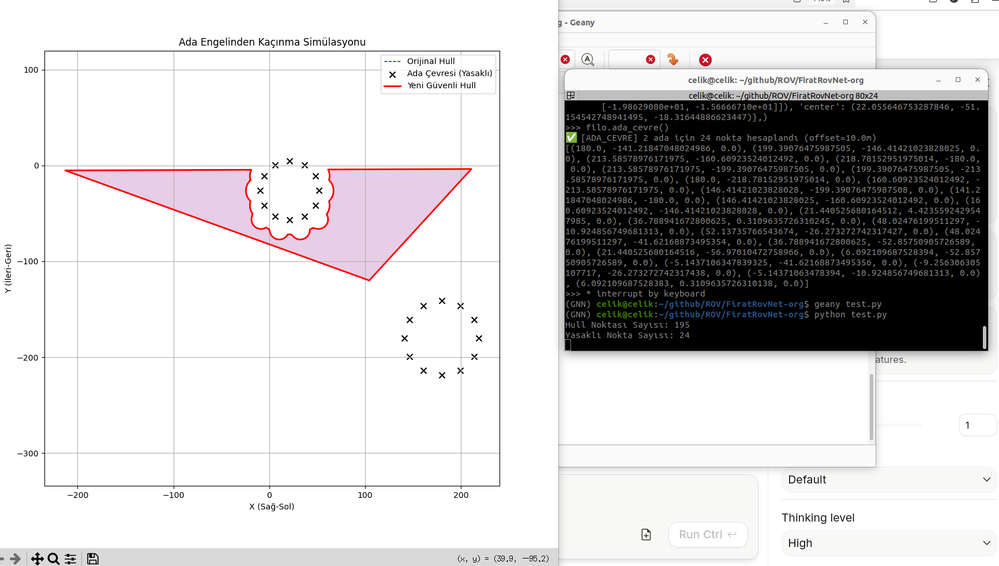

Şekil 4'te convex hull algoritması kullanılarak ROV sürüsü etrafında dinamik olarak oluşturulan güvenlik alanı gösterilmektedir. Sistem, ROV'ların gerçek zamanlı konumlarını analiz ederek sürekli güncellenen bir convex hull hesaplar ve bu hull'un etrafında 40 metre offset ile bir güvenlik çevresi oluşturur. Şekil 4'te görünen çokgen yapı, ROV'ların mevcut formasyonunu ve kapladıkları alanı gösterirken, etrafındaki güvenlik bandı, sürünün güvenli hareket sınırlarını tanımlar. Bu dinamik yaklaşım sayesinde, ROV'lar hareket ettikçe güvenlik çevresi de otomatik olarak güncellenir ve sürü her zaman belirli bir güvenlik mesafesi korur. Şekil 4, sistemin adaptif güvenlik çevresi oluşturma yeteneğini gösterir.

### ⚓ Formasyon Yönetimi

**Şekil 5: Formasyon Bazlı Convex Hull Güvenlik Çevresi**

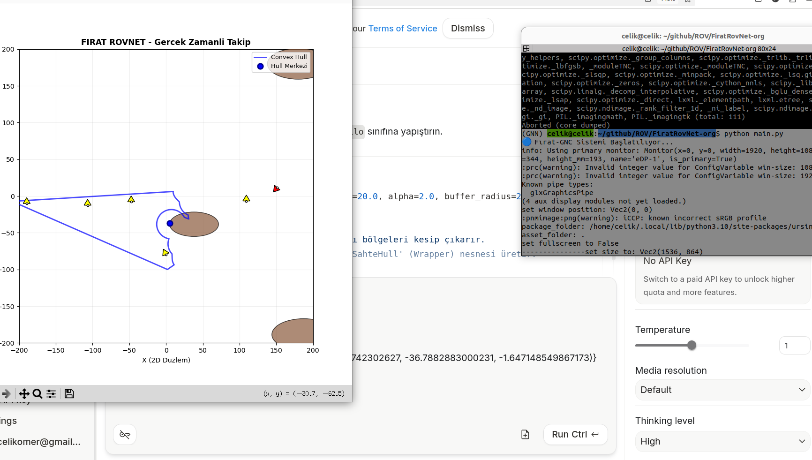

Şekil 5'te ROV sürüsünün formasyon yapısına göre oluşturulan convex hull ve güvenlik çevresi gösterilmektedir. Sistem, ROV'ların formasyon içindeki konumlarını tespit ederek bir convex hull hesaplar ve bu hull'un etrafında 40 metre offset ile bir güvenlik çevresi oluşturur. Şekil 5'te görünen çokgen yapı, ROV'ların formasyon düzenini ve kapladıkları alanı gösterirken, etrafındaki güvenlik bandı, sürünün güvenli hareket alanını tanımlar. Renk kodlaması sayesinde lider araç (kırmızı), normal seyir halindeki araçlar (turuncu) ve diğer durumlar ayırt edilebilir. Şekil 5, sistemin formasyon bazlı güvenlik çevresi oluşturma yeteneğini ve convex hull tabanlı koordinasyon mekanizmasını gösterir. Bu yaklaşım, ROV'ların formasyon içinde güvenli bir şekilde hareket etmesini sağlar.

### 🗺️ Harita ve Navigasyon

**Şekil 6: A* Algoritması ile Engelli Ortamda Güvenli Navigasyon**

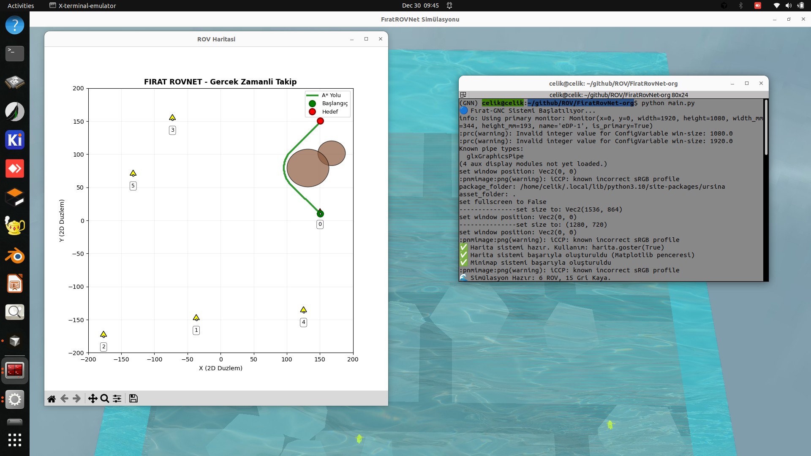

Şekil 6'da sistemin A* algoritması entegrasyonu ile engellerin bulunduğu ortamda güvenli rota planlaması gösterilmektedir. Şekilde görünen çizgiler, ROV'un başlangıç noktasından hedef noktaya kadar A* algoritması tarafından hesaplanan optimal ve güvenli rotayı temsil eder. Sistem, engelleri tespit ederek bu engellerin etrafından geçen güvenli bir yol hesaplar. Şekil 6'da görünen kırmızı veya gri şekiller engelleri gösterirken, yeşil veya mavi çizgi optimal rotayı gösterir. A* algoritması, her bir grid hücresinin maliyetini hesaplayarak hem en kısa hem de en güvenli yolu bulur. Şekil 6, sistemin engel kaçınma yeteneğini ve A* tabanlı güvenli navigasyon planlamasını gösterir. ROV, bu algoritma sayesinde karmaşık ve engelli ortamlarda bile hedeflerine güvenli bir şekilde ulaşabilir.

**Şekil 7: A* ile Çoklu Hedef ve Engelli Ortam Navigasyonu**

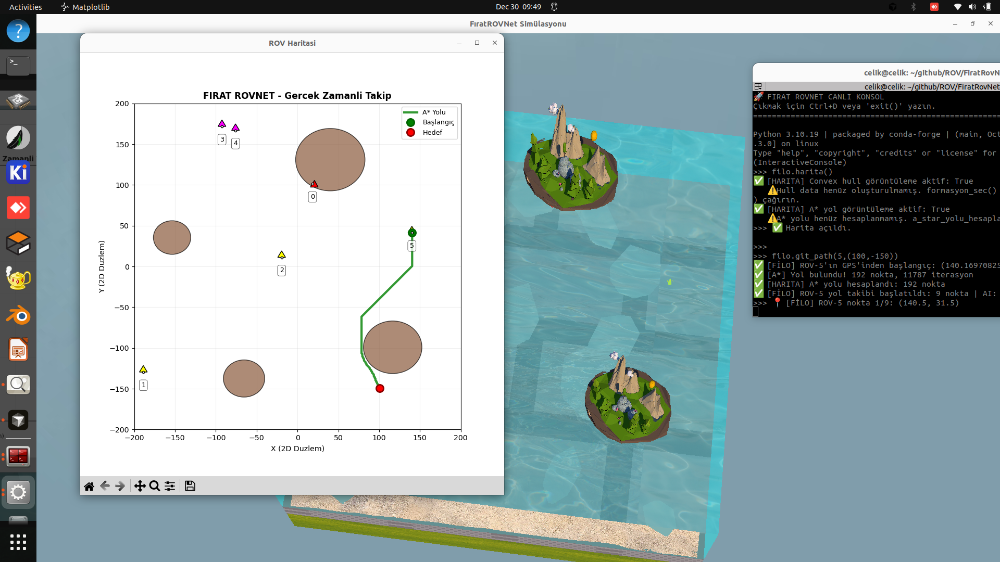

Şekil 7'de sistemin A* algoritması kullanarak çoklu hedef yönetimi ve engelli ortamda güvenli navigasyon özellikleri gösterilmektedir. Şekilde birden fazla hedef noktası görülebilir ve ROV'lar bu hedeflere A* algoritması ile hesaplanan güvenli rotalar üzerinden sırayla veya paralel olarak hareket edebilir. Harita üzerinde görünen farklı renkli şekiller farklı hedefleri, görevleri veya öncelik seviyelerini temsil ederken, engeller kırmızı veya gri renklerle gösterilir. A* algoritması, her hedef için engelleri dikkate alarak optimal ve güvenli rotalar hesaplar. Şekil 7, sistemin karmaşık görev senaryolarını yönetme yeteneğini ve A* tabanlı çoklu hedef optimizasyonunu gösterir. ROV'lar, görev gereksinimlerine göre hedefleri önceliklendirir ve engelli ortamlarda güvenli bir şekilde en uygun sırayla ziyaret eder.

### 🎮 3D Simülasyon ve Final Görünüm

**Şekil 8: 3D Fizik Motoru Detaylı Görünümü**

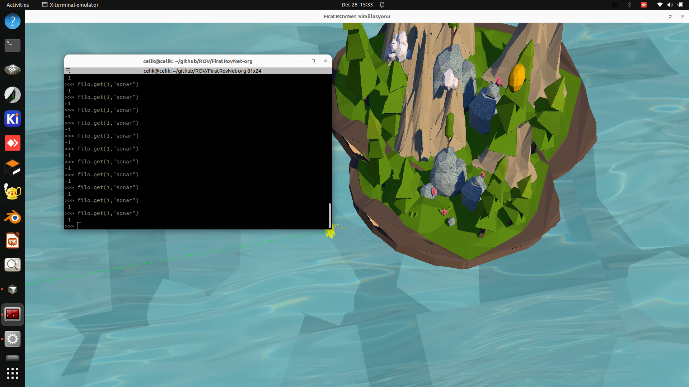

Şekil 8'de Ursina Engine tabanlı 3D simülasyon ortamının detaylı görünümü gösterilmektedir. Şekilde görünen üç boyutlu şekiller (küpler, küreler, düzlemler) ROV'ları, engelleri ve çevresel öğeleri temsil eder. Su yüzeyi, sualtı ortamı ve aydınlatma efektleri fiziksel gerçekçiliği artırır. ROV'ların renkleri durumlarını gösterirken, araçlar arasındaki bağlantı çizgileri iletişim ağını gösterir. Şekil 8, sistemin fizik motorunun (sürtünme, kaldırma kuvveti, motor itki dinamikleri) ve görselleştirme bileşenlerinin entegre çalışmasını gösterir. 3D simülasyon, kullanıcıya sistemin gerçek dünya davranışını anlamak için zengin bir görsel deneyim sunar.

**Şekil 9: A* Entegrasyonu ile Entegre Sistem Final Görünümü**

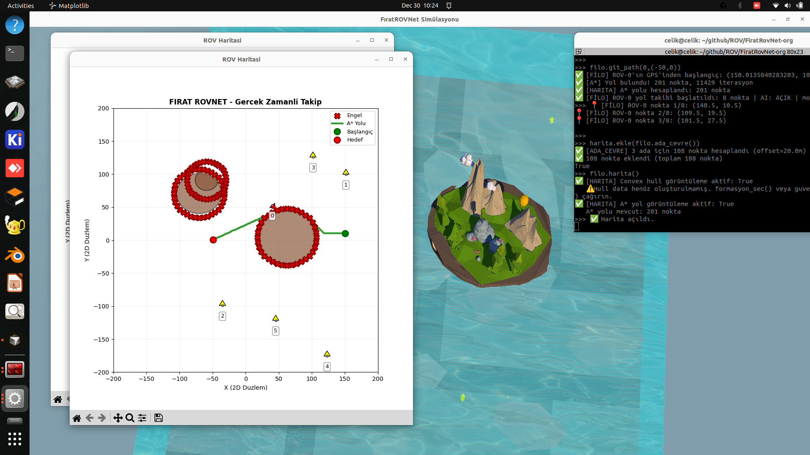

Şekil 9'da sistemin tüm bileşenlerinin entegre çalıştığı tam özellikli final görünümü gösterilmektedir. Şekilde 3D simülasyon ortamı, harita görünümü, formasyon yapısı, A* algoritması ile hesaplanan navigasyon planları ve konsol çıktıları birlikte görülebilir. ROV'lar farklı renklerle durumlarını gösterirken, iletişim bağlantıları, convex hull yapısı ve A* algoritması ile hesaplanan güvenli hareket yolları görselleştirilmiştir. Şekil 9, sistemin tüm modüllerinin (GAT yapay zeka, GNC navigasyon, A* yol planlama, fizik motoru, iletişim simülatörü) birlikte çalıştığını ve karmaşık görev senaryolarını başarıyla yönetebildiğini gösterir. Sistem, çoklu ROV koordinasyonu, A* tabanlı otonom navigasyon, engel kaçınma ve formasyon yönetimi gibi tüm özelliklerini entegre bir şekilde sunar. Şekil 9, Fırat-GNC sisteminin tam kapasitesini ve gerçek dünya uygulamalarına hazır olduğunu gösterir.

**Şekil 10: Convex Hull ile Güvenlik Çevresi Oluşturma**

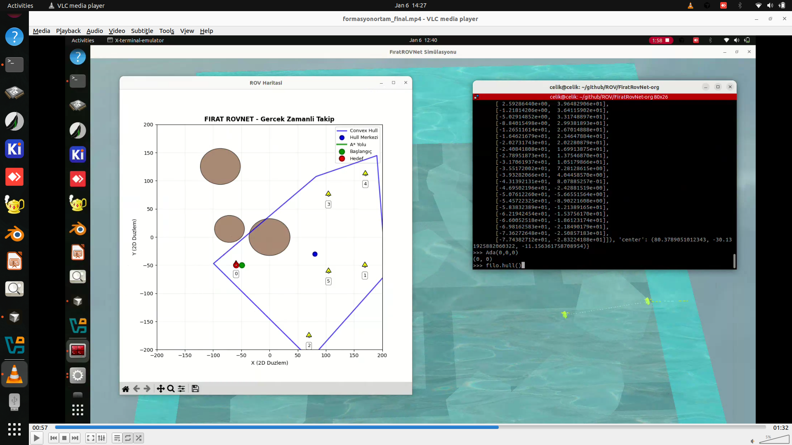

Şekil 10'da ROV sürüsünün convex hull algoritması kullanılarak güvenlik çevresi oluşturması detaylı bir şekilde gösterilmektedir. Sistem, ROV'ların konumlarını tespit ederek otomatik olarak bir convex hull (dışbükey örtü) hesaplar ve bu hull'un etrafında yaklaşık 40 metre offset ile bir güvenlik çevresi oluşturur. Şekil 10'da görünen çokgen yapı, ROV sürüsünün kapladığı alanı gösterirken, bu çokgenin etrafındaki güvenlik bandı, engeller olmadığında sürünün güvenli hareket alanını tanımlar. Bu yaklaşım sayesinde ROV'lar, birbirlerine ve çevreye belirli bir güvenlik mesafesi koruyarak hareket eder. Şekil 10, sistemin otomatik güvenlik çevresi oluşturma fonksiyonunun çalışmasını ve convex hull tabanlı formasyon yönetimini detaylı bir şekilde gösterir.

**Şekil 11: Engeller Tespit Edildiğinde Convex Hull Adaptasyonu**

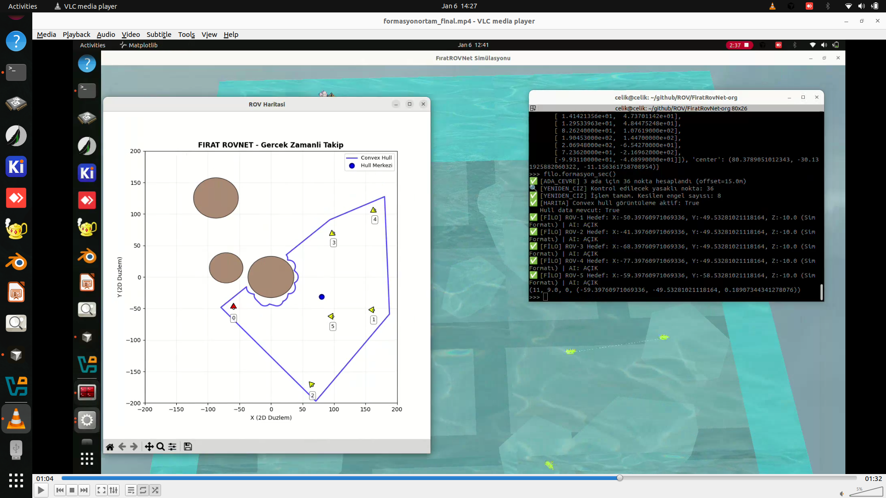

Şekil 11'de sistemin engeller tespit edildiğinde convex hull'un nasıl adapte olduğu ve engelleri dışarda bırakarak büküldüğü gösterilmektedir. Sistem, ROV'ların konumlarını ve çevredeki engelleri tespit ederek convex hull hesaplamasını dinamik olarak günceller. Şekil 11'de görüldüğü gibi, convex hull yapısı engellerin etrafından bükülerek engelleri dışarda bırakır ve sadece ROV'ların bulunduğu güvenli alanları içerir. Bu adaptif yaklaşım sayesinde, güvenlik çevresi engellerin etrafından geçerek ROV'ların güvenli hareket alanını doğru bir şekilde tanımlar. Şekil 11, sistemin engel tespiti sonrası convex hull adaptasyonu yeteneğini ve dinamik güvenlik çevresi oluşturma mekanizmasını gösterir. Bu özellik, sistemin gerçek dünya uygulamalarında engelli ortamlarda güvenilir çalışmasını sağlar.

---

## 📐 Motor ve GNC Mimarisi

ROV itki sistemi: **yerel koordinat** birim vektörleri, **dünya koordinatına** quaternion ile dönüştürülür; itki **skaler çarpım** (dot) ile dağıtılır, tork **vektörel çarpım** (r × F) ile hesaplanır. Akış özeti:

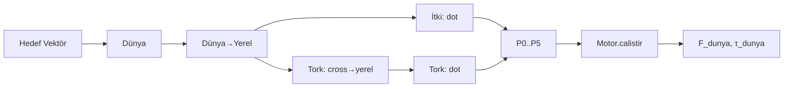
```mermaid
flowchart LR
    A[Hedef Vektör] --> B[Dünya]
    B --> C[Dünya→Yerel]
    C --> D[İtki: dot]
    C --> E[Tork: cross→yerel]
    E --> F[Tork: dot]
    D --> G[P0..P5]
    F --> G
    G --> H[Motor.calistir]
    H --> I[F_dunya, τ_dunya]
```

| Öğe | Açıklama |
|-----|----------|
| **Yerel ↔ Dünya** | Euler (Z→X→Y) ve quaternion; `dunya_to_yerel_vektor` skaler çarpımla izdüşüm. |
| **İtki dağılımı** | Hedef yerel vektör ile motor birim vektörlerinin dot çarpımı. |
| **Tork** | τ = r × F (moment kolu × kuvvet); yerel tork ile motor tork vektörlerinin dot çarpımı. |
| **Konfigürasyon** | 6 motor (4 yatay + 2 dikey), BlueROV2 benzeri; şema: `SCHEMA/ROV0/`. |

Detaylı formüller, motor tablosu ve şemalar: **[Motor ve İtki Sistemi](./docs/motor_tasarimi.md)** · **[GNC Mimarisi](./docs/gnc_mimari.md)** · **[APF Navigasyon](./docs/apf_navigasyon.md)** · **[BlueROV2 Sürü](./docs/BlurROV2Surusu.md)**.

---

## 📂 Proje Yapısı

```text
FiratRovNet-org/
│
├── main.py                     # Ana çalıştırıcı (simülasyonu başlatır)
├── Models-AI/                  # Eğitilmiş AI model ağırlıkları
│   ├── GAT/
│   ├── YOLO/
│   └── SAC/
├── docs/                       # Teknik dokümantasyon (GNC, Motor, APF, BlueROV2)
├── KILAVUZ/                    # Kullanım kılavuzları (Konsol, Senaryo)
│
└── FiratROVNet/                # Çekirdek kütüphane
    ├── __init__.py
    ├── config.py                # Canlı ayar ve sabitler (cfg, GAT, sensör, motor)
    ├── simulasyon.py            # 3D ortam, fizik, minimap (Ortam, sim_olustur)
    ├── senaryo.py               # Headless senaryo ve GAT veri üretimi
    ├── camera_manager.py        # ROV FPV kamera ve ekran bölgeleri
    ├── iletisim.py              # Akustik modem simülatörü
    ├── hull.py                  # Convex hull ve güvenlik çevresi
    ├── a_star.py                # A* yol planlama
    ├── gnc/                     # Güdüm, Navigasyon ve Kontrol
    │   ├── __init__.py          # Filo, TemelGNC
    │   ├── motor.py             # Motor itki/tork ve BlueROV2 konfigürasyonu
    │   └── ...
    └── kutuphane/               # Helper modülleri (gnc_helper, EntityLoader, vb.)
```

---

## 🛠️ Kurulum

Gerekli Python kütüphanelerini yükleyin:

```bash
pip install torch torch_geometric ursina numpy networkx scipy
```

---

## 🧠 Yapay Zeka Eğitimi (GAT)

İlk çalıştırmadan önce veya modeli güncellemek için isteğe bağlı eğitim yapılabilir.

- **Komut:** `python -m GAT.gat_train [--epochs 200] [--no-resume]`
- Veri kaynağı: senaryo tabanlı `filo.gat_veri_uret()`
- Eğitim sonunda model `Models-AI/GAT/rov_modeli_multi.pth` konumuna kaydedilir.

---

## 🚀 Çalıştırma

**Linux (grafik uyumluluk modu):**

```bash
LIBGL_ALWAYS_SOFTWARE=1 python main.py
```

**Windows:**

```bash
python main.py
```

Simülasyon açıldıktan sonra **minimap** sol tıklanarak hedef eklenir; **F** tuşu ile makale kalitesinde ekran görüntüsü `Pictures/` klasörüne kaydedilir.

---

## 💻 Canlı Konsol Komutları

Simülasyon çalışırken terminalde Python kabuğu (`>>>`) açık kalır; aşağıdaki fonksiyonlar ve değişkenler kullanılabilir.

### 1️⃣ Otonom görev atama — `git`

```python
git(rov_id, x, z, y=None, ai=True)
```

| Parametre | Açıklama |
|-----------|----------|
| `rov_id`  | ROV indeksi (0, 1, 2, …) |
| `x`, `z`  | Yatay düzlem koordinatları |
| `y`       | Derinlik (opsiyonel; negatif = su altı) |
| `ai`      | `True`: zeki mod (GAT/APF) / `False`: kör mod |

**Örnekler:**

```python
>>> git(0, 50, 50, -5)
>>> git(1, -20, 100, -10, ai=False)
>>> for i in range(4):
...     git(i, i*10, 100, -5)
```

### 2️⃣ Manuel hareket — `move`

```python
move(rov_id, yon, guc=1.0)
```

- **Yönler:** `'ileri'`, `'geri'`, `'sag'`, `'sol'`, `'cik'`, `'bat'`, `'dur'`
- **Güç:** `0.0`–`1.0` (örn. `1.0` = %100)

**Örnek:** `>>> move(0, "ileri", 1.0)`

### 3️⃣ Veri okuma — `get`

```python
get(rov_id, veri_tipi)
```

- **Veri tipleri:** `'gps'`, `'batarya'`, `'hiz'`, `'rol'`, `'sensör'`, `'sonar'` vb.

**Örnek:** `>>> get(0, 'gps')`

### 4️⃣ Ayar değiştirme — `set`

```python
set(rov_id, ayar_adi, deger)
```

- **Ayar örnekleri:** `'engel_mesafesi'`, `'iletisim_menzili'`, `'rol'`, `'renk'` vb.

**Örnek:** `>>> set(0, "engel_mesafesi", 50.0)`

### 5️⃣ Ortam nesneleri — `Ada`, `ROV`

```python
Ada(ada_id, x=None, y=None)   # Ada konumu / listeleme
ROV(rov_id, x=None, y=None, z=None)  # ROV konumu / listeleme
```

### 6️⃣ Sistem ayarları — `cfg`

```python
>>> cfg.goster_modem = True   # İletişim mesajları
>>> cfg.goster_gnc = True    # Navigasyon mesajları
>>> cfg.goster_sistem = True # Genel sistem mesajları
```

### 7️⃣ Referanslar

- **`filo`** — Filo nesnesi (hedef, formasyon, kamera, nav kuyruğu)
- **`rovs`** — ROV entity listesi
- **`nav_queue`** — Grup bazlı hedef kuyruğu (minimap tıklama ile eklenen hedefler)

### 8️⃣ Kamera

- **R tuşu:** Bilgi paneli ve takip kamerası bir sonraki ROV’a geçer; `filo.kamera_ayarla(rov_id=...)` ile aynı ROV’a odaklanılır.
- Konsoldan: `>>> filo.kamera_ayarla(rov_id=1)` — ROV-1 FPV kamerası aktif edilir.

---

## 🌈 Renk kodları ve durumlar

| Renk       | Durum        | Açıklama                          |
|------------|--------------|------------------------------------|
| 🔴 Kırmızı | Lider / Engel| Lider araç veya engel algılandı   |
| 🟠 Turuncu | Güvenli      | Normal seyir                      |
| ⚫ Siyah   | Çarpışma     | Acil durum                        |
| 🟡 Sarı    | Kopuk        | İletişim menzili dışında         |
| 🟣 Mor     | Uzak         | Liderden aşırı uzak               |

---

## 🛑 Çıkış

Simülasyonu güvenli kapatmak için **ESC** veya **Q** tuşuna basın.

---

## 👨‍💻 Geliştirici

**Ömer Faruk Çelik**  
Fırat Üniversitesi – Otonom Sistemler & Yapay Zeka Laboratuvarı

---

## 📜 Lisans

MIT License
