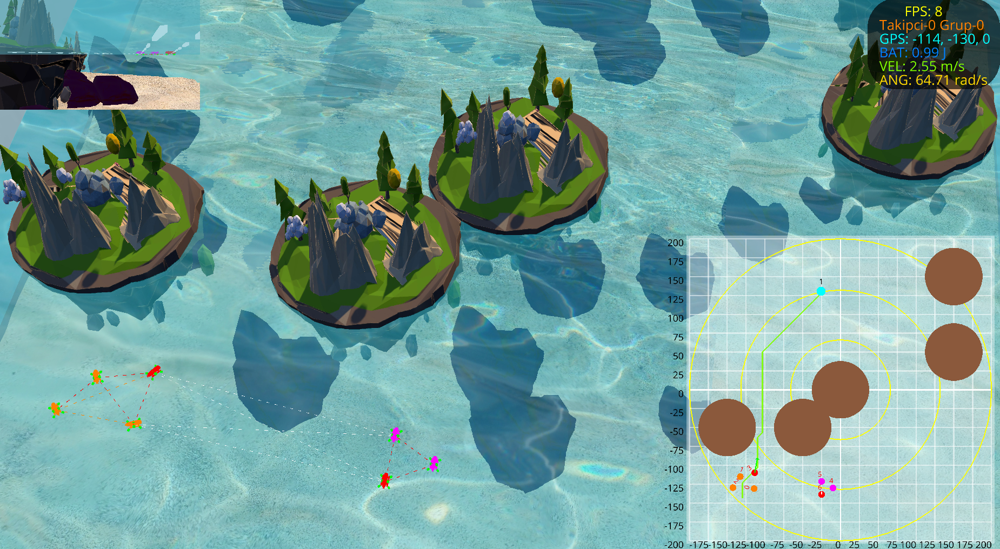
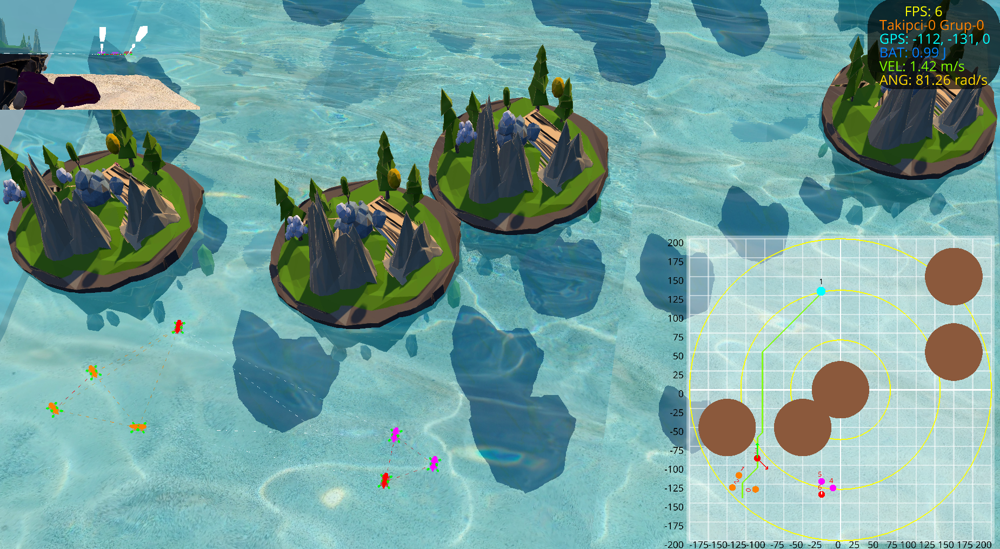
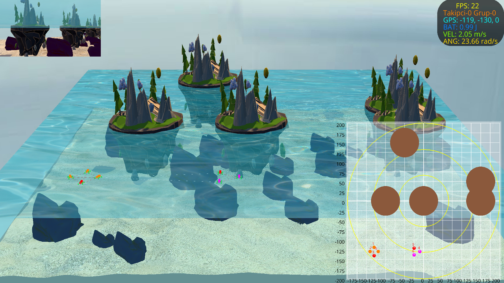
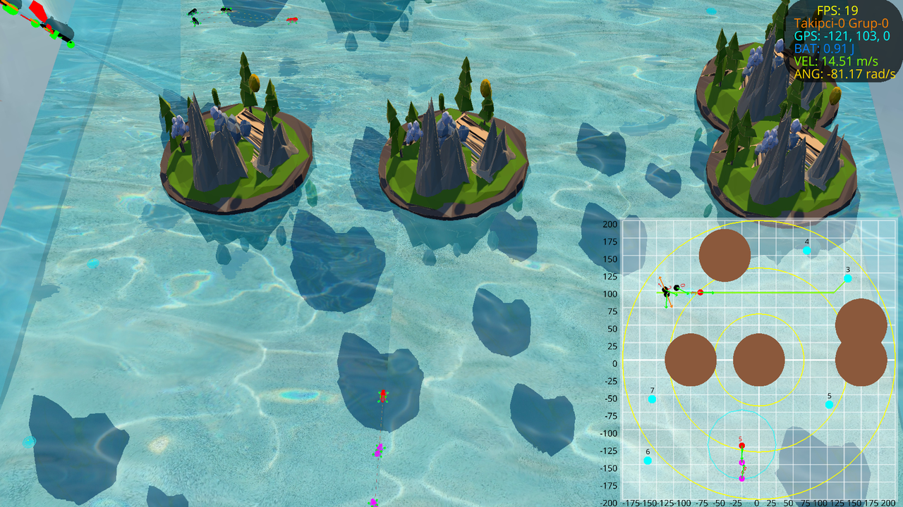
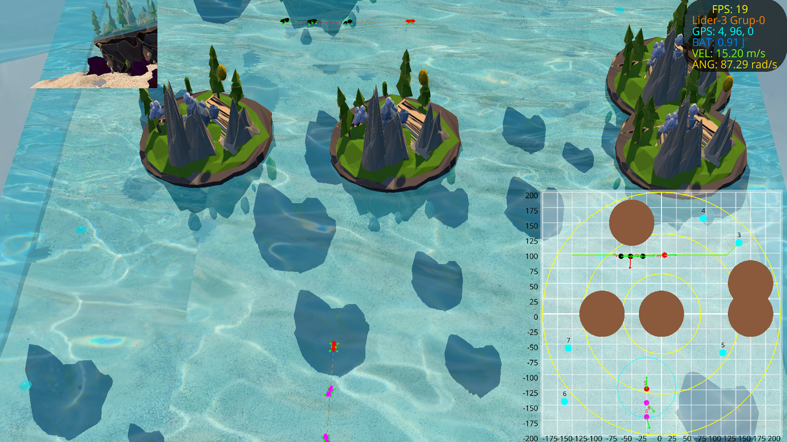
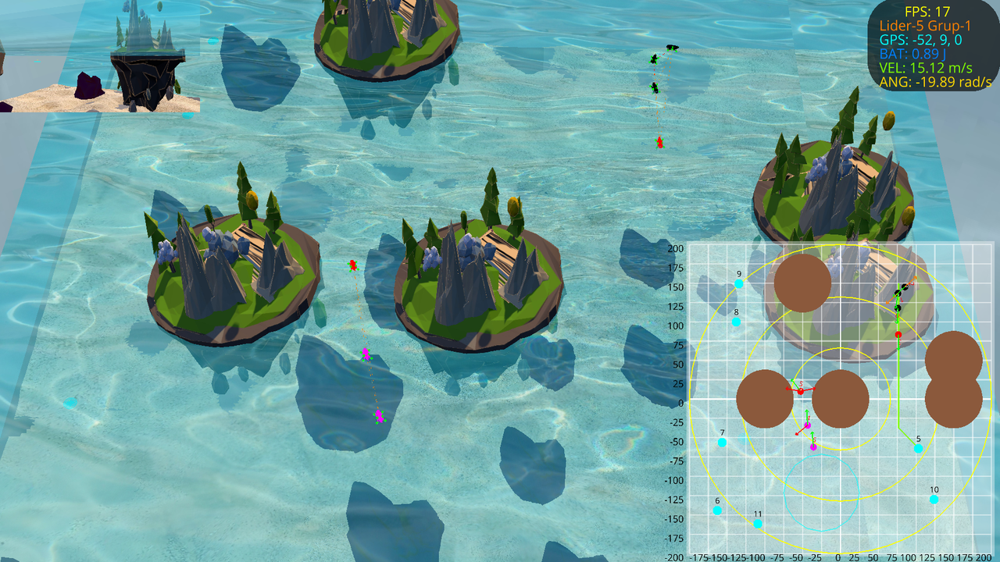
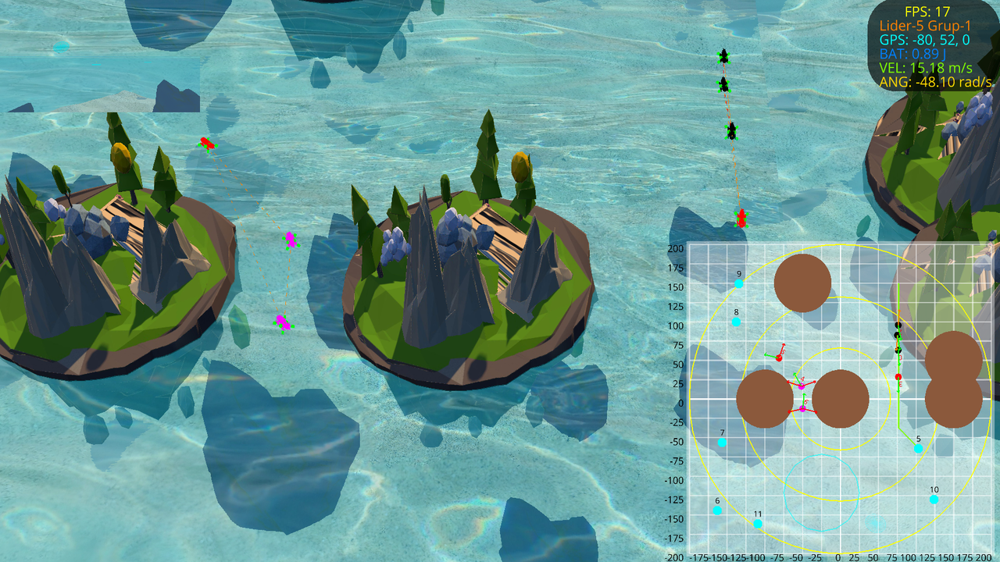
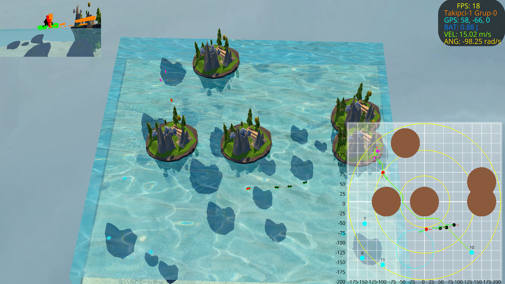

# BlueROV2 Sürü Simülasyonu: Grup Hiyerarşisi, Formasyon Seçimi ve A\* ile Navigasyon

Bu belge, Fırat-GNC ortamında **BlueROV2** benzeri çoklu ROV sürüsünün **grup hiyerarşisi**, **formasyon_sec** ile seçilen araçların takibi ve **A\*** algoritması ile hedefe gidişini özetler. Görseller simülasyon ekranından alınmıştır.

---

## Özet

Sürüde her ROV bir **grup (group)** içinde tanımlanır; grupta **lider** ve **takipçi** rolleri vardır. **formasyon_sec** ile formasyon tipi ve hangi ROV’ların hedefe gideceği seçilir; seçilen araçlar **A\*** ile engellerden kaçınan güvenli rota üzerinden hedefe yönlendirilir. Aşağıdaki şekiller, simülasyon anındaki ekran görüntüleriyle bu akışı göstermektedir.

---

## Şekiller

**Şekil 1:** Simülasyon ortamı genel görünümü — BlueROV2 sürüsü ve havuz.

*Şekil 1: Simülasyon ortamında ROV sürüsünün başlangıç konumu ve havuz düzeni.*

---

**Şekil 2:** Simülasyon ortamı alternatif açı.

*Şekil 2: ROV’ların ve ortamın farklı kamera açısından görünümü.*

---

**Şekil 3:** Grup hiyerarşisi ve formasyon — lider/takipçi ayrımı.

*Şekil 3: ROV gruplarının hiyerarşik yapısı ve formasyon_sec ile seçilen formasyonun görselleştirmesi.*

---

**Şekil 4:** Formasyon seçimi sonrası seçilen ROV’ların takibi.

*Şekil 4: formasyon_sec ile belirlenen araçların hedefe doğru takibi.*

---

**Şekil 5:** A\* ile hedefe güvenli rota.

*Şekil 5: A* algoritması ile hesaplanan engelden kaçınan rota ve sürünün bu rotayı izlemesi.*

---

**Şekil 6:** BlueROV2 sürüsü ile hedefe ilerleyiş.

*Şekil 6: BlueROV2 konfigürasyonundaki ROV’ların grup hiyerarşisi ve formasyon dahilinde hedefe ilerlemesi.*

---

**Şekil 7:** Rota takibi ve formasyon koruması.

*Şekil 7: A* rotası üzerinde ilerlerken formasyonun korunması.*

---

**Şekil 8:** Hedefe varış — sürü düzeni.

*Şekil 8: Sürünün hedef bölgesine ulaşması ve son konum düzeni.*

---

## Referans

- GNC mimarisi ve motor dağılımı: [Motor ve İtki Sistemi](./motor_tasarimi.md), [GNC Mimarisi](./gnc_mimari.md).
- BlueROV2 motor şeması: [SCHEMA/ROV0](../SCHEMA/README.md).

*Fırat Üniversitesi – Otonom Sistemler & Yapay Zeka Laboratuvarı*
