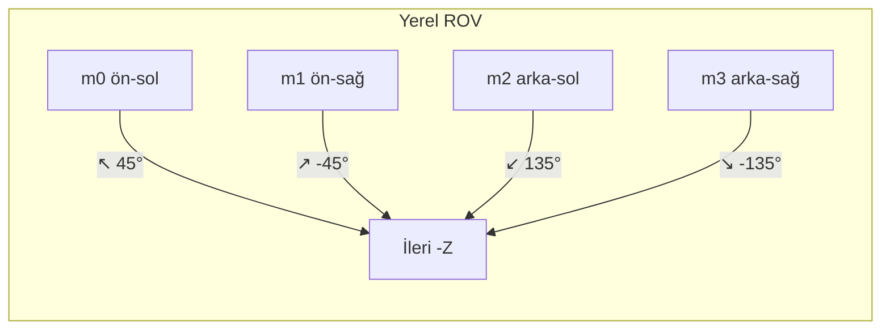
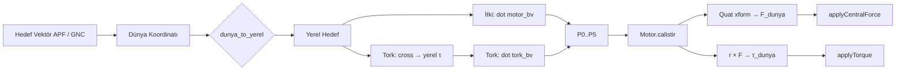
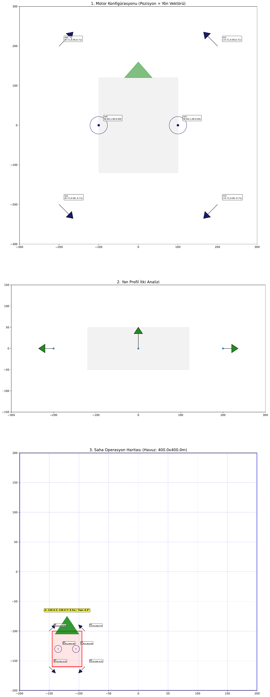

# ⚙️ Motor ve İtki Sistemi

Bu belge, Fırat-GNC ROV **motor konfigürasyonu**, **yerel–dünya koordinat dönüşümleri**, **itki/tork formülleri** ve **skaler/vektörel çarpım** ile güç dağılımını akademik notasyonla açıklar.

---

## 1. Motor Konfigürasyonu (BlueROV2 Benzeri)

Sistemde araç başına **6 itki motoru** kullanılır: **4 yatay (surge/sway)** + **2 dikey (heave)**. ROV modelinde ileri yön **-Z** (Ursina konvansiyonu): İleri = -Z, Sağ = +X, Yukarı = +Y.

| Motor | Konum (yerel) | Yön (Euler °) | Rol |
|-------|----------------|---------------|-----|
| m0 | (-200, 0, 200) | (90, 45, 0) | Ön-sol (yatay) |
| m1 | (200, 0, 200) | (90, -45, 0) | Ön-sağ (yatay) |
| m2 | (-200, 0, -200) | (90, 135, 0) | Arka-sol (yatay) |
| m3 | (200, 0, -200) | (90, -135, 0) | Arka-sağ (yatay) |
| m4 | (-100, 0, 0) | (0, 0, 0) | Dikey-sol (heave) |
| m5 | (100, 0, 0) | (0, 0, 0) | Dikey-sağ (heave) |

### 1.1. Üst Görünüm (Yatay Düzlem — İtki Vektörleri)



Yatay motorların birim itki yönleri (yerel): yaklaşık **±(√2/2, 0, ±√2/2)**; dikey motorlar **(0, 1, 0)**.

---

## 2. Koordinat Dönüşümleri

### 2.1. Euler → Yön Vektörü (Yerel)

Görsel rotasyon (Ursina) ile matematiksel matris sıralaması eşleştirilmiştir: **Önce Z, sonra X, en son Y**.

$$ \mathbf{v}_{yerel} = R_y(\psi)\, R_x(\theta)\, R_z(\phi)\, \mathbf{v}_{ref} $$

Referans vektör silindir ekseni için $\mathbf{v}\_{ref} = (0,1,0)$; Ursina Z işareti uyumu için $\phi \rightarrow -\phi$ kullanılır.

<details>
<summary><b>📐 Matris formülleri (tıklayarak açın)</b></summary>

$$
R_x(\theta) = \begin{bmatrix} 1 & 0 & 0 \\ 0 & c_\theta & -s_\theta \\ 0 & s_\theta & c_\theta \end{bmatrix}, \quad
R_y(\psi) = \begin{bmatrix} c_\psi & 0 & s_\psi \\ 0 & 1 & 0 \\ -s_\psi & 0 & c_\psi \end{bmatrix}, \quad
R_z(\phi) = \begin{bmatrix} c_\phi & -s_\phi & 0 \\ s_\phi & c_\phi & 0 \\ 0 & 0 & 1 \end{bmatrix}
$$

Kodda: `res = Ry @ (Rx @ (Rz @ v_np))`.

</details>

### 2.2. Yerel → Dünya (Quaternion)

Motor itkisi önce **yerel birim yön** $\hat{\mathbf{f}}\_i$ ve kuvvet büyüklüğü $F\_i$ ile tanımlanır; dünya koordinatına ROV quaternion'ı ile dönüştürülür:

$$ \mathbf{F}_{i,dunya} = q \otimes \hat{\mathbf{f}}_i \otimes q^* \cdot F_i $$

Uygulamada `quat.xform(yon_vec) * mag` ile hesaplanır.

### 2.3. Dünya → Yerel (Skaler Çarpım ile İzdüşüm)

Dünya vektörünü ROV’un yerel eksenlerine taşımak için ROV’un **sağ**, **yukarı** ve **ileri** birim vektörleri ($\hat{x}\_r$, $\hat{y}\_r$, $\hat{z}\_r$) kullanılır; izdüşümler skaler çarpımla alınır:

$$ v_{yerel,x} = \mathbf{v}_{dunya} \cdot \hat{x}_r, \quad v_{yerel,y} = \mathbf{v}_{dunya} \cdot \hat{y}_r, \quad v_{yerel,z} = \mathbf{v}_{dunya} \cdot \hat{z}_r $$

Bu, hedef hareket vektörünün motor birim vektörleriyle eşleştirilmesi için kullanılır.

---

## 3. İtki ve Tork (Vektörel Çarpım)

Her motor $i$ için **moment kolu** $\mathbf{r}\_i$ (motor pozisyonu, ölçekleme uygulanmış) ve **itki vektörü** $\mathbf{F}\_i$ (dünya ekseninde) ile tork:

$$ \boldsymbol{\tau}_i = \mathbf{r}_i \times \mathbf{F}_i $$

Kodda: `world_rel_pos = quat.xform(actual_l_pos)`, `world_torque = world_rel_pos.cross(world_force)`. Yaw ekseni (Ursina/Panda3D el uyumu) için $\tau\_y \rightarrow -\tau\_y$ düzeltmesi uygulanır.

### 3.1. Net Tork (Süperpozisyon)

$$ \boldsymbol{\tau}_{net} = \sum_{i} \mathbf{r}_i \times \mathbf{F}_i $$

$F\_i = u\_i \cdot F\_{max}$; $u\_i \in [-1, 1]$ normalize motor komutu.

---

## 4. Güç Dağılımı (Skaler Çarpım)

### 4.1. Öteleme (İtki Yönüne Dağıtım)


Hedef **dünya vektörü** ($\mathbf{h}_{dunya}$), ROV'un o anki yönelimine göre yerel eksene iz düşürülür:

$$ \mathbf{h}_{yerel} = \text{dunya\_to\_yerel}(\mathbf{h}_{dunya}) $$

Her bir motor $j$ için itki katsayısı, motorun yerel birim itki vektörü $\hat{\mathbf{m}}_j$ ile yerel hedef vektörünün skaler çarpımı (iz düşümü) ile hesaplanır:

$$ P_j = (\hat{\mathbf{m}}_j \cdot \mathbf{h}_{yerel}) \cdot g $$

Burada $g$ genel güç oranını ($0 \leq g \leq 1$), $P_j$ ise ilgili motora gönderilecek nihai güç komutunu temsil eder.

### 4.2. Dönme (Tork Ekseni Dağılımı)

İstenen **dünya torku** (yatay düzlemde yön hatalarından): $\boldsymbol{\tau}\_{dunya} = \mathbf{V}\_{yatay} \times \mathbf{h}\_{yatay}$. Bu tork yerel eksene çevrilir; her motorun **yerel tork yeteneği** $\hat{\boldsymbol{\tau}}\_{m,j}$ ($\mathbf{r}\_j \times \hat{\mathbf{m}}\_j$ ile tutarlı) ile skaler çarpılır:

$$ P_j^{tork} = \hat{\boldsymbol{\tau}}_{m,j} \cdot \boldsymbol{\tau}_{istenen,yerel} \cdot g_{tork} $$

---

## 5. Sistem Akış Şeması



---

## 6. Şema ve Veri Kaynakları (SCHEMA/)

Klasör isimleri ROV’ları temsil eder; her ROV klasöründe **rov_motor_sema.pdf** (motor yönleri ve yerleşim şeması) ve **bilgi.json** (konum/birim yön vektörleri) bulunur. Yeni ROV eklemek için `SCHEMA/ROV<id>/` oluşturup bu iki dosyayı ekleyin; liste güncellemesi için `python SCHEMA/update_readme.py` çalıştırılır.

- **[SCHEMA/README.md](../SCHEMA/README.md)**: Mevcut ROV şemalarının canlı listesi (PDF + bilgi.json linkleri).
- **FiratROVNet/gnc/schema_export.py**: Şema çizimi ve `bilgi.json` export.

İleride eklenebilecekler: APF parametreleri, GAT girdi/çıktı şemaları, iletişim protokolü.

---

## 7. Motor Şemaları

### ROV0 (BlueROV2 benzeri)

[📄 PDF Olarak İndir](../SCHEMA/ROV0/rov_motor_sema.pdf) | [📊 Birim Vektör Verileri (JSON)](../SCHEMA/ROV0/bilgi.json)




### Diğer ROV'lar (ROV1, ROV2, …)

```markdown
### ROVx

[PDF indir](../SCHEMA/ROVx/rov_motor_sema.pdf)
```

---

*Fırat Üniversitesi – Otonom Sistemler & Yapay Zeka Laboratuvarı*
